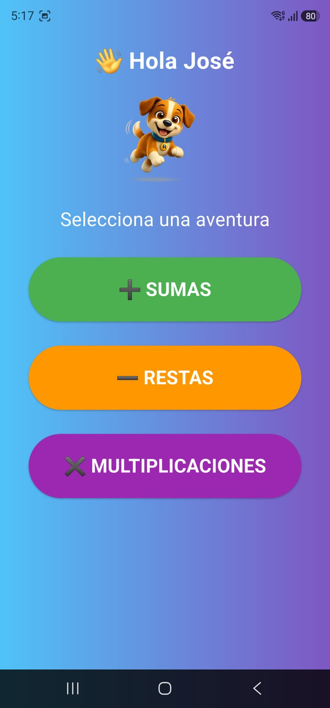
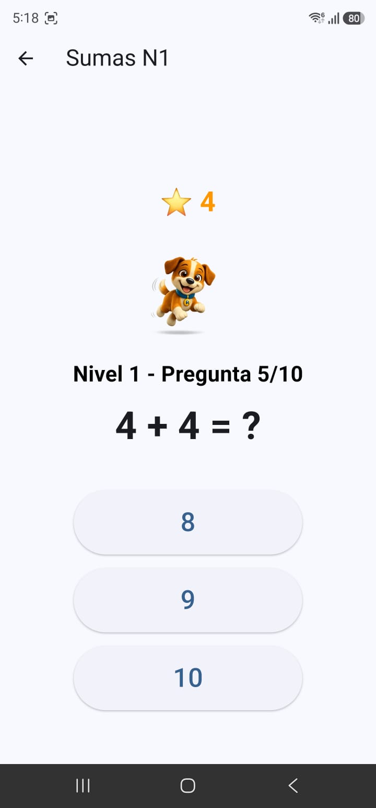
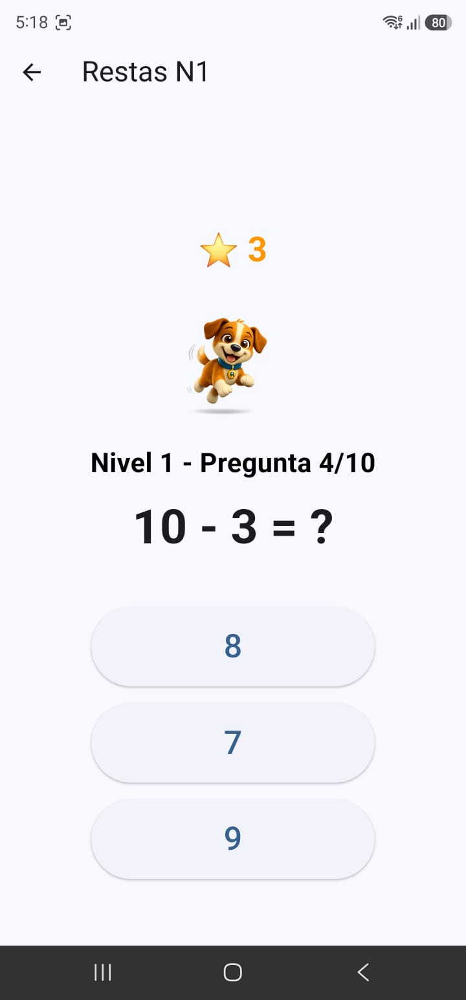
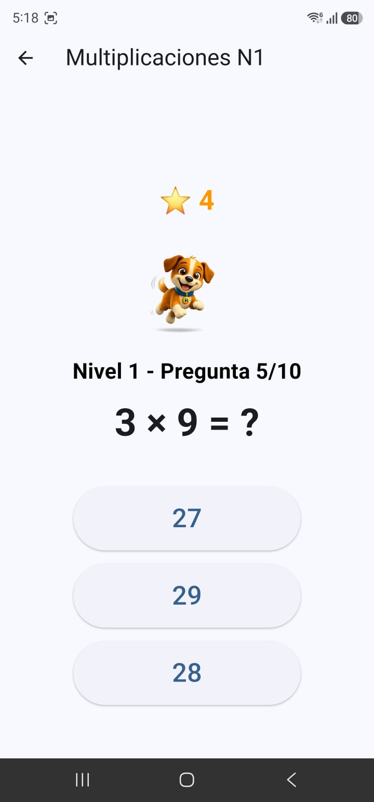
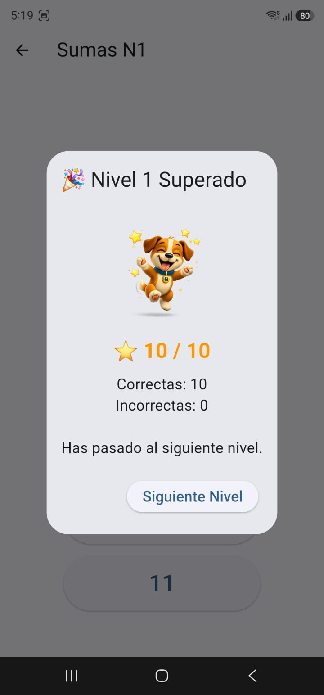

# Curso de APP Móvil

# Primera aplicación móvil "Aprende Jugando"
## Aplicación educativa móvil desarrollada con Flutter y Dart

**Autora:** Deisy Esquivia  

**Programa:** Ingeniera de Sistemas  

**Plataforma:** Android  

**Versión:** 1.0.0

---

## Autora

### Deisy Esquivia

Estudiante de Ingeniería de Sistemas.

**Aprende Jugando** es un proyecto de desarrollo de una aplicación móvil educativa realizado como parte del proceso de aprendizaje y formación en desarrollo de aplicaciones móviles.

El proyecto integra programación, diseño de interfaces, lógica de programación, pruebas, documentación técnica y generación de una aplicación para dispositivos Android.

---

## Descripción del proyecto

Aprende Jugando es una aplicación educativa móvil dirigida a niños para practicar operaciones matemáticas básicas de una manera sencilla, interactiva y divertida.

La aplicación permite practicar:

- Sumas

- Restas

- Multiplicaciones

El juego utiliza preguntas, niveles, estrellas, resultados y una mascota que acompaña al jugador durante la experiencia.

---

## Objetivo

El objetivo de Aprende Jugando es apoyar el aprendizaje y la práctica de operaciones matemáticas básicas mediante una experiencia de juego interactiva.

La aplicación busca combinar educación, tecnología, interacción y una experiencia de usuario sencilla para niños.

---

## Sistema de niveles

La aplicación cuenta con tres niveles.

Cada nivel contiene diez preguntas.

Para superar un nivel se necesitan como mínimo ocho respuestas correctas de diez.

El sistema permite que el jugador avance progresivamente mientras practica las diferentes operaciones matemáticas.

---

## Características principales

- Tres niveles de juego.

- Diez preguntas por nivel.

- Mínimo ocho respuestas correctas para superar cada nivel.

- Sistema de estrellas.

- Sistema de resultados.

- Mascota interactiva.

- Sumas.

- Restas.

- Multiplicaciones.

- Aplicación para dispositivos Android.

- Funcionamiento sin conexión a Internet.

---

# Capturas de pantalla

# Capturas de pantalla

# Aprende Jugando

## Aplicación educativa móvil desarrollada con Flutter y Dart

**Autora:** Deisy Esquivia  
**Programa:** Ingeniería de Sistemas  
**Plataforma:** Android  
**Versión:** 1.0.0

---

## Autora

### Deisy Esquivia

Estudiante de Ingeniería de Sistemas.

**Aprende Jugando** es un proyecto de desarrollo de una aplicación móvil educativa realizado como parte del proceso de aprendizaje y formación en desarrollo de aplicaciones móviles.

El proyecto integra programación, diseño de interfaces, lógica de programación, pruebas, documentación técnica y generación de una aplicación para dispositivos Android.

---

## Descripción del proyecto

Aprende Jugando es una aplicación educativa móvil dirigida a niños para practicar operaciones matemáticas básicas de una manera sencilla, interactiva y divertida.

La aplicación permite practicar:

- Sumas
- Restas
- Multiplicaciones

El juego utiliza preguntas, niveles, estrellas, resultados y una mascota que acompaña al jugador durante la experiencia.

---

## Objetivo

El objetivo de Aprende Jugando es apoyar el aprendizaje y la práctica de operaciones matemáticas básicas mediante una experiencia de juego interactiva.

La aplicación busca combinar educación, tecnología, interacción y una experiencia de usuario sencilla para niños.

---

## Sistema de niveles

La aplicación cuenta con tres niveles.

Cada nivel contiene diez preguntas.

Para superar un nivel se necesitan como mínimo ocho respuestas correctas de diez.

El sistema permite que el jugador avance progresivamente mientras practica las diferentes operaciones matemáticas.

---

## Características principales

- Tres niveles de juego.
- Diez preguntas por nivel.
- Mínimo ocho respuestas correctas para superar cada nivel.
- Sistema de estrellas.
- Sistema de resultados.
- Mascota interactiva.
- Sumas.
- Restas.
- Multiplicaciones.
- Aplicación para dispositivos Android.
- Funcionamiento sin conexión a Internet.

---

# Capturas de pantalla

## Pantalla de bienvenida

---

## Selección de aventuras

---

## Sumas

---

## Restas

---

## Multiplicaciones

---

## Resultados

---

# Desarrollo con Inteligencia Artificial

Durante el desarrollo de Aprende Jugando se utilizó Inteligencia Artificial como herramienta de apoyo para aprender, planificar, desarrollar, solucionar errores y documentar el proyecto.

La Inteligencia Artificial fue utilizada como apoyo durante diferentes etapas del desarrollo, mientras que el funcionamiento de la aplicación fue revisado y probado durante el proceso.

---

## 1. Creación del prompt

El primer paso consiste en explicar correctamente a la Inteligencia Artificial qué aplicación se desea desarrollar.

El prompt debe indicar claramente:

- Nombre de la aplicación.
- Objetivo.
- Usuarios.
- Funcionalidades.
- Pantallas.
- Diseño visual.
- Colores.
- Navegación.
- Reglas del juego.
- Tecnologías que se desean utilizar.

Mientras más clara y detallada sea la información proporcionada, más precisa puede ser la orientación recibida.

---

## 2. Creación del expediente técnico

Durante el desarrollo del proyecto se elaboró un expediente técnico de la aplicación.

El expediente técnico permite documentar detalladamente el proyecto y conservar información importante sobre el proceso de desarrollo.

El documento incluye información relacionada con:

- Descripción del proyecto.
- Objetivos.
- Alcance.
- Requerimientos funcionales.
- Requerimientos no funcionales.
- Diseño de la aplicación.
- Estructura de las pantallas.
- Navegación.
- Tecnologías utilizadas.
- Lógica de funcionamiento.
- Recursos utilizados.
- Pruebas.
- Instalación.
- Generación del APK.

### Expediente técnico

El expediente técnico se encuentra dentro de la carpeta documentación del repositorio.

[Consultar Expediente Técnico](documentación/Expediente_Tecnico_Aprende_Jugando.pdf)

---

## 3. Preparación del entorno de desarrollo

Para desarrollar la aplicación móvil se instaló y configuró el entorno necesario para trabajar con Flutter.

### Herramientas utilizadas

- Flutter
- Dart
- Android Studio
- Visual Studio Code
- PowerShell

PowerShell se utilizó para ejecutar los comandos necesarios durante la creación, configuración, ejecución y compilación del proyecto.

---

## 4. Creación del proyecto

Una vez preparado el entorno de desarrollo, se creó el proyecto utilizando Flutter.

La Inteligencia Artificial permitió recibir orientación sobre:

- Comandos de Flutter.
- Ubicación del proyecto.
- Organización de carpetas.
- Ejecución de la aplicación.
- Solución de errores.
- Generación del APK.

La ubicación utilizada para el proyecto fue:

C:\CURSOAPP\APPS_EDUCATIVAS\aprende_jugando